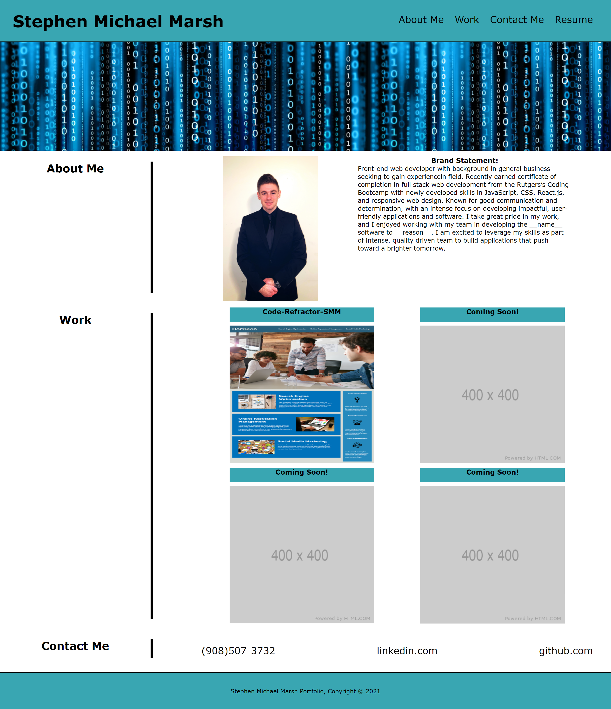

# Portfolio-SMM

This project is a homework assignment for Rutgers Coding Bootcamp.

## Click link to open in browser.
​
[github pages site] https://imaparadox.github.io/Portfolio-SMM/
​
## Description 
When the user loads their portfolio, they are presented with the developer's name, recent photo or avatar, and links to sections about them, their work, and how to contact them. When a link is clicked in the navigation the user is brought to the corresponding section. The user's work can also be accessed through the work section by clicking the image, which brings the user to their other deployed applications. The hover pseudo-class has been added to the images for further readability. Finally, media queries have been added for mobile device responsiveness. 

## Notes
Everything loaded correctly, and there are no indications of bugs from what I observed. Extremely difficult to add media queries smaller than my current max-width resolution of 575px.

## Acknowledgments for advice and assistance:
Reuben Genkin

Johnny Salvato  

## License
N/A